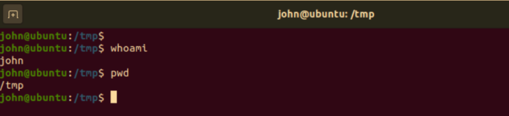
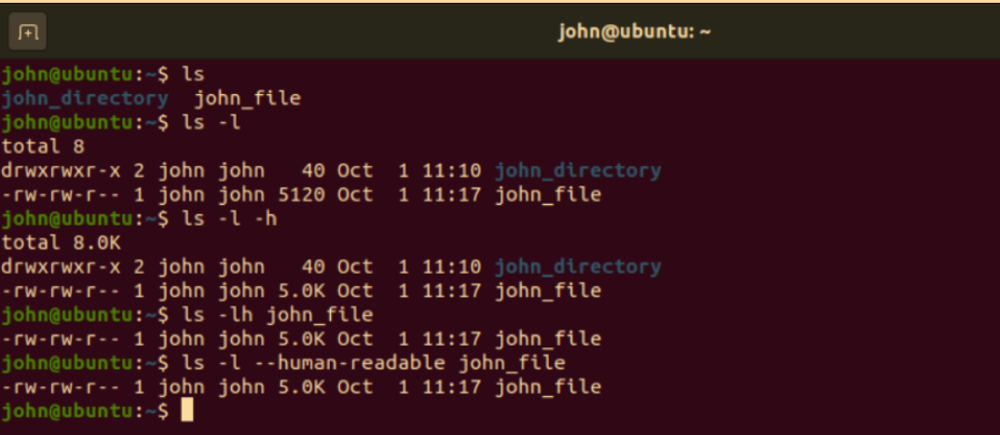
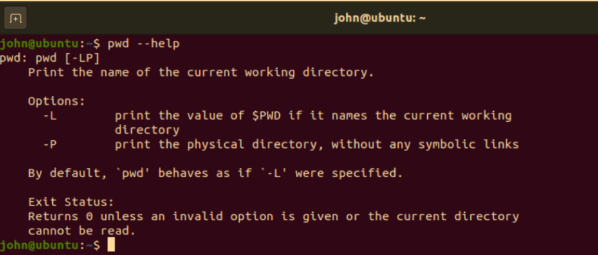
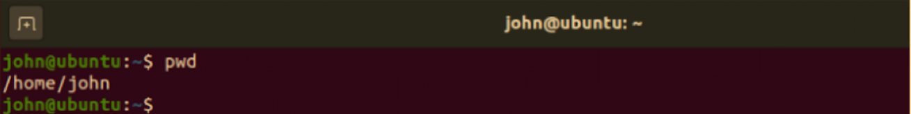
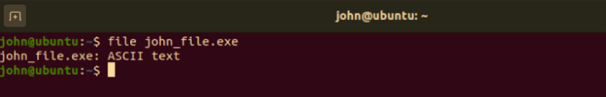
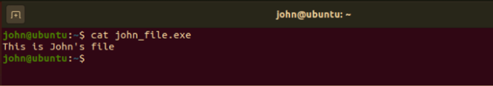
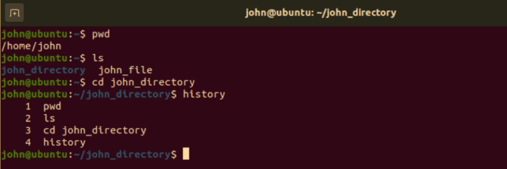
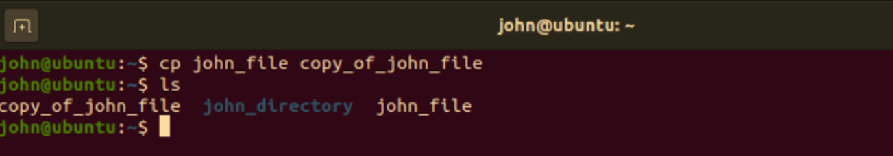
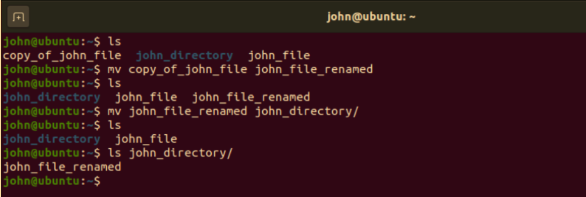
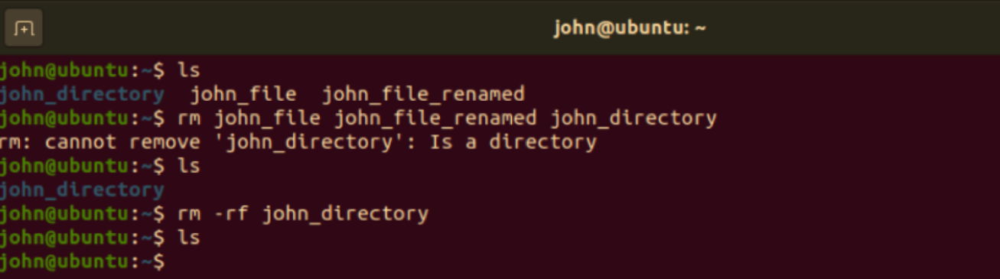

# Linux Command Line

## 视频：Linux Command Line

欢迎回到 Linux 操作系统。 

Welcome back to the Linux operating system. 

在本模块的最后一课中，我们将讨论 Linux 的命令行。  

In this last lesson of this module, we're going to think about the Linux command line. 

从现在开始，你将会在本课程中学习越来越多的命令。  

Now, later on throughout this course, you're going to learn more and more commands. 

此处我们仅是浅尝辄止。

We're just going to get a little taste here.

---

Linux 桌面有一个图形用户界面，我们称之为 GUI，但大多数安装使用命令行进行。

The Linux desktop has a **graphical user interface**, we called it a GUI, but most installations use the command line. 

我们在之前的课上讲过 90% 的云是基于 Linux 的，大多数时候，我们称之为 **SSH'ing**，你会得到一个终端会话并使用云端服务器的命令行，因为这比在云端显示图形用户界面要快。  

We talked earlier in an earlier lesson that 90 percent of the cloud is Linux, and most of the time, what we call SSH'ing, you're getting a terminal session and using the command line of a server that's out in the cloud because that's faster than trying to display a graphical user interface across the cloud. 

shell 为您提供了一个访问 Unix 系统的接口，有许多不同的 shell，您可以选择自己的shell，但标准的 shell 是 Bourne shell，当使用 Bourne shell 等待某个命令时，您将得到一个美元字符作为提示符。  

A shell provides you with an interface to the Unix system, and it's different shells, you can choose your own shell, but the Bourne shell is the standard one, and you'll get a dollar sign character as the prompt when it's waiting for a command with the Bourne shell. 

一些常用命令，**PWD** 会返回当前工作目录的路径。  

Some common commands, PWD is going to return the path of the current working directory. 

你可以在屏幕图像中看到。  

You see that in the screen image. 

你会在屏幕图像中看到，我输入了一个 PWD 命令，它显示了 /home/aspen，那是我此时所在的目录。  

You'll see in the screen image, I did a PWD and it shows home aspen, that's the directory I'm in at the time. 

`Cd` 命令可以改变目录，但是也有不同的方法可以做到这一点。 

 Cd changes the directory, and there's different ways to do it. 

所以你可以 `cd ..`  向上移动一个目录。  

So you can cd..  to move one directory up. 

文件系统中的目录是分层的，稍后会详细讨论。  

Directories in the file system are hierarchical, we'll talk more about that later. 

但是在示例截图中有 /home/aspen，如果我输入 `cd..`  

But in the example in the screenshots has home aspen, if I do a cd.. 

那么我将会回到 home 目录。  

I go back to home.

---

如果只输入 cd，将转到主目录或用户的主文件夹。此外，使用 cd ＋连字符会移动到之前所在的目录。 

If you type just the cd on its own, you'll go to the home directory or the home folder for the user, and cd with a hyphen to move to your previous directory. 

`Ls` 允许您查看目录的内容，同时该命令还有几个选项。  

Ls lets you view the contents of a directory, and there's several switches. 

`ls -R` 会列出子目录中的所有文件，`ls -a` 会显示隐藏的文件。  

There's ls -R will list all the files in the sub-directories as well, ls -a will show hidden files. 

隐藏文件和其他文件一样，只是默认不显示。  

Hidden files are files just like any other files, but they don't show up by default. 

`Ls -al` 将列出文件和目录的详细信息，如权限大小，所有者等。  

Ls -al will list the files and directories with detailed information like the permission size, owner, etc.

---

`cat` 命令在标准输出中列出文件的内容， 

The cat command lists the contents of a file on standard output,

---

我们将学习很多关于标准输出和重定向标准输出的内容。 

and we're going to learn a lot about standard output and redirecting standard output. 

此处给出一个例子，比如说 `cat`，我们用大于符号 > 重定向到 filename，会创建一个新文件，或者 cat filename 1, filename，空格，filename 2，重定向到 filename 3 会把两个文件连接到这个新文件名。  

But you'll see an example here where we say cat, and we redirect with the greater than symbol to filename, is going to create a new file, or cat filename 1, filename2, space, redirect to filename 3 is going to join the two files to this new filename. 

`cp` 命令会复制文件，你面前的屏幕截图中有个例子，我复制了一个名为 my.txt 的文件，它应该在当前目录中，我将它复制到了 home 2 目录中。  

The cp command is going to copy files, you'll see an example in the screenshot in front of you where I'm just copying a file called my.txt, that's got to be in the current directory, and I'm copying it to the directory home two. 

Mv会移动或者重命名文件，make directory会在当前目录下创建一个新目录，rm会删除一个文件和目录，rm -r会删除一个目录和其中的所有文件。  

Mv is going to move or rename files, make directory is going to create a new directory in the current directory, rm is going to remove a file and directory, and rm -r is going to remove a directory and all the files inside of it. 

我将做一些例子，你将有一个可以在实验室中使用的Linux终端。  I'll do some examples, and you'll have a Linux terminal that you can play with in the lab. 

这里回顾一下，PWD 命令将显示当前目录，ls命令将列出目录的内容，而cat命令将列出文件的内容。  But just to review here, the PWD command will show you the current directory, the ls command will list the contents of a directory, and the cat command will list the contents of a file. 

实验室见。  See you in the lab.

## 阅读材料：Linux Command Line

## Linux Command Line-Reading

###  Introduction

Linux 命令行是计算机的文本页面。

The Linux command line is a text interface to your computer.

也被称为 shell、终端、控制台、命令提示符等，是一种用于解释命令的计算机程序。

Also known as shell, terminal, console, command prompts and many others, is a computer program intended to interpret commands.

允许用户通过在终端手动输入命令来执行命令，或者具有自动执行用 “Shell脚本” 编写的命令的能力。 

Allows users to execute commands by manually typing at the terminal, or has the ability to automatically execute commands which were programmed in “Shell Scripts”.

###  A bit of history

伯恩壳(sh)最初是由斯蒂芬伯恩在贝尔实验室工作时开发的。

The Bourne Shell (sh) was originally developed by Stephen Bourne while working at Bell Labs.

1979 年在 Unix 版本 7 中发布，分发给学院和大学。

Released in 1979 in the Version 7 Unix release distributed to colleges and universities.

The Bourne Again Shell (**bash**) 是作为 Bourne Shell 的自由和开源替代品编写的。

The Bourne Again Shell (bash) was written as a free and open source replacement for the Bourne Shell.

由于Bash 的开放性，随着时间的推移，它已经被大多数 Linux 系统采用为默认 shell 。

Given the open nature of Bash, over time it has been adopted as the default shell on most Linux systems.

###  First look at the command line

现在我们已经介绍了一些基础知识，让我们打开一个终端窗口，看看它是什么样子! 

Now that we have covered some basics, let’s open a terminal window and see how it looks!

当终端打开时，它会显示一个提示符。

When a terminal is open, it presents you with a prompt.

让我们分析一下上面的截图:

Let's analyze the screenshot above:

第 1 行: shell 提示符，它由 username@hostname:location\$ 组成

**Line 1**: The shell prompt, it is composed by username@hostname:location\$

用户名:用户名是 “john” 。

Username: our username is called “john”

Hostname:我们登录到的系统的名称

Hostname: The name of the system we are logged on

Location:我们所在的工作目录

Location: the working directory we are in

\$:分隔提示符的结尾

\$: Delimits the end of prompt

在 \$ 符号之后，我们可以键入命令并按回车，以执行该命令。

After the \$ sign, we can type a command and press Enter for this command to be executed.

第2行:在提示符之后，我们键入命令whoami，它代表“我是谁”，并按键盘上的[Enter]。

Line 2: After the prompt, we have typed the command whoami which stands for “who am i“ and pressed [Enter] on the keyboard.

第3行:显示我们之前发出的 whoami 命令的结果，也称为命令输出。

Line 3: Shows us the result of the whoami command we have previously issued, also known as command output. 

这个命令只是打印出当前用户的用户名。

This command simply prints out the username of the current user.

第4行:显示了另一个名为 pwd 的基本命令的示例，pwd 表示打印工作目录

Line 4: Shows an example of another basic command called pwd which stands for print working directory.

第5行:如前所示，这一行显示了之前发出的命令的结果。 

Line 5: As seen before, this line shows the result of the command previously issued. 

/tmp是我们的工作目录。

/tmp is our working directory.

第6行:向我们显示一个新的提示符，并等待我们输入一个新命令。 

Line 6: Presents us with a new prompt, and waits for us to type a new command.

### Commad syntax

我们可以不带参数直接运行命令，也可以接受参数来改变它们的行为。

Commands can be run by themselves, or can accept arguments to alter their behavior.

典型的语法如下所示: 

A typical syntax can look similar to this:

`command [-argument] [--long-argument] file`

Example：

例子：

首先，我们输入命令 ls ，它代表列表。 

At first, we entered the command ls which stands for list. 

默认情况下，这个命令会打印当前目录的内容。

By default this command will print the content of the current directory.

其次，我们通过输入空格和 -l 为 ls 添加了一个参数。 

Secondly, we have added an argument to ls by typing a space and -l. 

这个参数改变了 ls 的输出格式，它代表“long listing format”(长列表格式)。

This argument is changing the output format of ls and stands for “long listing format”.

接下来，我们添加了另一个参数 -h ，它代表 “human”，这个参数指示 ls 命令以人类可读的格式打印文件大小。

Next, we have added another argument -h which stands for “human”, this argument instructs the ls command to print file size in a human readable format.

稍后，我们组合了两个参数，-lh中的-l和-h，它们会给我们相同的结果，并且我们给了一个文件名“ls”。 

Later on, we have combined two arguments, -l and -h in -lh which gives us the same result and we have given a file name to “ls”. 

结果只显示了最后一个参数传递的文件。

The result shows us only the file passed as the last argument.

作为最后一个例子，我们将短参数 -h 替换为等价的长参数形式——人类可读。 

As a final example, we have replaced the short argument -h with its equivalent long argument form --human-readable. 

如你所见，命令的输出没有改变。  

As you can see, the command’s output didn’t change.

### Notes

在使用 Linux shell 时，有几件重要的事情需要记住。

There are a few important things to keep in mind when using a Linux shell:

- 区分大小写 It is case sensitive
  在 Linux shell 中，命令、文件和目录名是区分大小写的，这意味着键入pwd将打印当前工作目录，键入 pwd 将返回类似于 -bash: pwd: command not found 的错误
   In a Linux shell, commands, files and directory names are case sensitive meaning that typing pwd will print the current working directory and typing PWD will return an error similar to -bash: PWD: command not found

- / (斜杠)是一个特殊字符，用作目录分隔符
   The / (forward-slash) is a special character used as directory separator
  Linux CLI 有很多特殊字符，我们将详细讨论这个主题。 The Linux CLI is full of special characters, and we will go into more detail about this topic. 现在，请记住这一点。For the moment, just keep this in mind.

- 文件扩展名并不重要
   File extensions don’t matter
  如果你熟悉 Windows 系统，那么带有 exe 扩展名的文件意味着它是可执行文件。 If you come from a windows background, a file with .exe extension means it is an executable file. 在Linux CLI中，文件类型是自动确定的。  In Linux CLI, the file kind is determined automatically. (通过读取文件头)。(By reading the file header).

- 几乎每个 Linux 命令都支持 --help 参数
   Nearly every Linux command supports --help argument
  在使用 CLI 的过程中，你经常会想:“我需要用什么参数来做 X ?”此时可以用 --help 寻找答案。 During your journey with the CLI, you will often wonder “what argument do I need to do X?”  The answer is just a --help away.

###  Basic commands

太好了，你已经走到这一步了。 

Fantastic, you have made it this far. 

你已经证明了你的动力!
  You have proven your motivation!

在使用CLI时，有一些基本的命令即使是最专业的用户也会经常使用。
 When using the CLI there are some basic commands which are used constantly even by the most expert users.

这些命令使我们能够执行基本操作，例如移动文件夹结构，收集信息，执行更改。
 Those commands enable us to perform basic operations such as moving around the folders structure, gather information, perform changes.

我们已经看到了其中的一些，例如我们使用 pwd 打印工作目录，使用ls列出目录的内容，但现在让我们扩展一下我们的命令列表!
 We have seen some of those already, for example we have used pwd to print the working directory and ls to list the content of a directory, but now let’s expand our list of commands!

####  pwd

如前所述，pwd 只会打印出当前工作目录。 As we have seen before, pwd will simply print out the current working directory.

#### ls

我们之前已经使用过这个命令，并且我们已经知道它是做什么的。 

We have already used this command before, and we already know what it does. 

它列出了给定目录的内容。  It lists the content of a given directory. 

这个命令的特点是支持广泛的参数。  

The peculiarity of this command is that it supports a wide range of arguments.

#### file

如果您阅读了前面的说明，我们已经说过，linux 不依赖于文件扩展名来理解它所处理的文件类型。
 If you read the notes earlier, we stated that linux does not rely on file extension to understand what kind of file it is dealing with.

这个命令将显示作为参数传递的文件的类型。
 This command will show the kind of a file passed as argument.

在下面的示例中，我们看到 john_file 具有 “.exe” 扩展名，file 命令输出真正的文件类型，在本例中是一个简单的文本文件。 

In the example below, we see john_file with a “.exe” extension, the file command outputs the real file kind, in this case a simple text file.

#### cat

`cat` 命令接收给定的文本文件作为参数并打印出其内容。

#### cd

cd命令表示更改目录 (Change Directory) ，它会将你的工作目录更改为作为参数传递的目录。 

The cd command, which stands for Change Directory, will change your working directory to the one passed as argument.

注意，提示符也发生了变化。 Note how the prompt has changed as well.

#### clear

在使用终端一段时间后，你的屏幕看起来会很混乱。

After some time using the terminal, your screen will look messy and confusing.

要清理屏幕并重新开始，请键入 clear 命令。 

To clear the screen and start all over, type the `clear` command.

#### history

history命令将显示在终端会话中输入的命令的历史列表。 

The history command, will show an historical list of commands that were entered in the terminal session.

#### cp

cp命令即copy，用于创建文件/目录的副本。
 The cp command, which stands for copy, is used to create a copy of a file/directory.

要创建 john_file 的副本并将其命名为copy_of_john_file，我们将使用 cp 命令。 

To create a copy of john_file and call our copy copy_of_john_file we will use the cp command.

#### mv

`mv` 命令表示移动，用于将文件/文件夹移动到新位置或重命名。

The mv command, which stands for move, moves a file/folder to a new location, or renames it.

为了将文件 `copy_of_john_file` 重命名为 `john_file_renamed` 重命名，我们将使用 mv。

To rename the `file copy_of_john_file` to `john_file_renamed` we will use the mv.

要将文件 john_file_ 重命名到john_directory中，我们仍然使用mv。

To move the file john_file_renamed inside john_directory we will still use mv.

注意:当在终端中指定一个文件时，结尾的斜杠“/”表示它是一个目录。 

Note: When specifying a file in the terminal, a trailing forward-slash “/” indicates it is a directory.

与cp一样，即使我们的操作成功执行，mv命令也不会产生任何输出。 

Like cp, the mv command will not produce any output even though our operation was performed successfully.

#### rm

我们今天文章的最后一个命令是rm，它代表删除。

Our last but not least command for today’s article is `rm`, which stands for remove.

它用于删除文件，但也可以根据指示删除目录。
 It is used to delete files, but can delete directories as well if instructed to do so.

现在让我们尝试删除所有文件和我们创建的文件夹。 

Let’s try now to delete all files and the folder we have created.

如你所见，一开始我们试图删除所有内容。 

As you can see, at first we have tried to delete everything altogether. 

与前面的命令类似，rm命令通常不会产生任何输出，除非产生错误。

The rm command like the previous commands will normally not produce any output unless an error is generated.

我们的命令产生了一个错误，说john_directory是一个目录，默认情况下不会被删除。 

Our command produced an error saying that john_directory is a directory and by default will not be removed. 

这两个文件(john_file和john_file_重命名)被删除了，所以操作只部分执行，除了屏幕上显示的错误The two files (john_file and john_file_renamed) are removed, so the operation is executed partially, with the only exception regarding the errors shown on screen.

通过向 rm 添加两个参数，我们也可以实现文件夹的删除。

By adding two arguments to `rm` we can achieve the folder’s removal as well.

参数是 -r(recursive) 和 -f(force)。 

The arguments are -r (recursive) and -f (force). 

前者引导操作对递归包含在作为参数传递的目录上的每个文件和文件夹进行操作，而后者迫使操作忽略错误并禁用任何确认提示。
  The first one induces the operation to work on every single file and folder contained recursively on the directory(ies) passed as argument(s), while the latter forces the operation ignoring errors and disabling any confirmation prompt.

## Lab：Week1 Lab

### Instructions

Use the slides from the 1st lesson reading and try each of the commands discussed in the cloud implementation of Debian Linux.  When you enter the cloud lab - please click on the terminal menu and new terminal.  This will give you a command line prompt in an debian Linux shell.

You should try out these commands we talked about this week:

- pwd
- cd
- ls
- cat
- cp
- mv
- mkdir
- rm

Make sure you try the command options we discussed in the lectures
