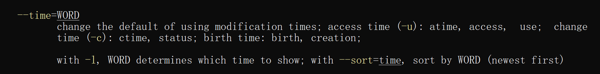
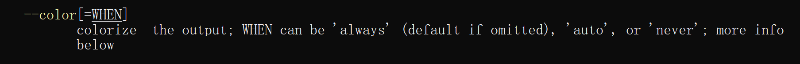
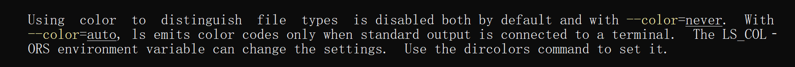

# MIT-Missing-Semester

## 前言

此篇文章记录课后习题的解决思路以及我的想法。当我自己做不出来时会参考官方答案并反思为什么没做出来。

## shell tools

#### 问题一

阅读 [`man ls`](https://man7.org/linux/man-pages/man1/ls.1.html) ，然后使用`ls` 命令进行如下操作：

- 所有文件（包括隐藏文件）
- 文件打印以人类可以理解的格式输出 (例如，使用454M 而不是 454279954)
- 文件以最近访问顺序排序
- 以彩色文本显示输出结果

---------

1. 阅读man手册页，ls命令用于显示目录的内容。其中的-a选项说不要忽略以.（点）开头的项。结合类unix系统隐藏文件是以.开头的知识，可以推断出-a选项就是不要忽略隐藏文件的意思。所以第一个问题的答案是：

```
ls -a
```

2. 根据给出的例子推断最后显示的输出要有M，看了一下应该对应--block-size=SIZE这个选项，scale sizes是缩放寸尺的意思，手册提到这个选项要和-l一起用，因为长格式的时候才会出现文件大小。现在把单位缩放到MB就好了，我不确定原来的单位是不是就是单纯的byte？454M=45427995？没确定。不管怎样，这题的答案应该是：

```
ls -l --block-size=M
```

3. 和时间有关，找到了--time=WORD这个选项，WORD的取值有一个-u表示access time，这应该就是要找的访问时间。可恶，这几个选项串一起让我有点难理解，答案应该是下面这样的



```
ls --time=atime --sort=time -l
```

4. 彩色显示输出





这个color应该是会将不同类型的文件用不同的颜色表示，默认情况下是禁用的（我怎么感觉我的不是禁用的，难道我对以上文档理解有问题？），所以现在手动开启它。

```
ls --color=always
```

